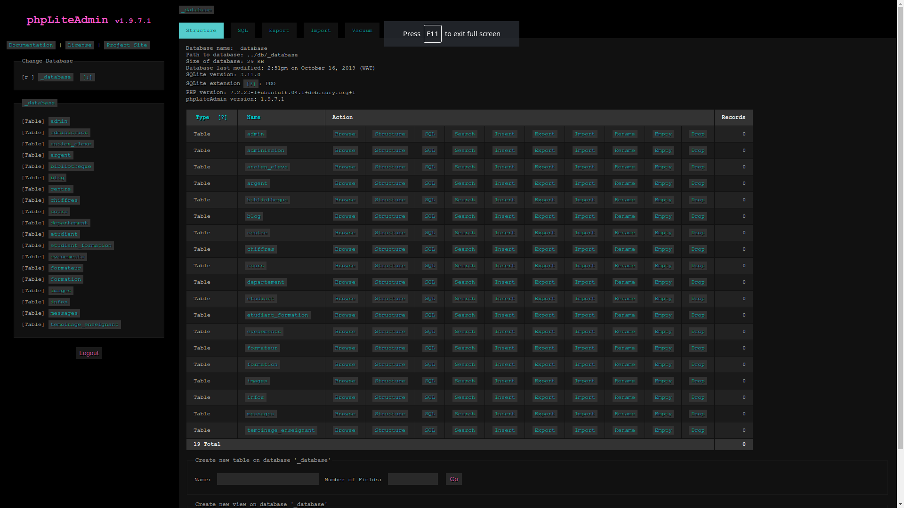

# REST-PHP-API

This is a simple Boilerplate of a RESTAPI in PHP from scratch, handleling a CRUD examplle and authentification process with a MVC structure.
This Boilerplate is connected to a database that can be a SQLite or a real SQL database.

## How to launch

Just start the server and try accessing to `index.php`.

## ORM

Go to `./models/example.php` to get a whole documentation of the ORM used here.

## Usage

We are in an MVC architecture, 

### A sample of a Model

Code:

```php


```

### A sample of a View

Code:

```php

<?php
	// Create
	$result = array();
	$output = array();
	if($required){

		// Insertion
		$BD->from($element)
		    ->insert($data)
		    ->execute();

		$rows = $BD->from($element)
			->where(array($element.'_id' => $BD->insert_id))
			->select()
			->one();

		foreach ($rows as $key => $val)
		  if (!is_int($key))
		    $output[$key]=$rows[$key];

		$result['status'] = 'success';
		$result['output'] = $output;

	}else{
		$result['status'] = 'error';
		$result['output'] = "Please, check your entries";
	}

	echo json_encode($result);
?>
```

### A sample of a Controller

Code:

```php


```


## Addons

An integrated PhpLiteAdmin is provide for managing your own SQLite database:




## Author

- Sanix-darker